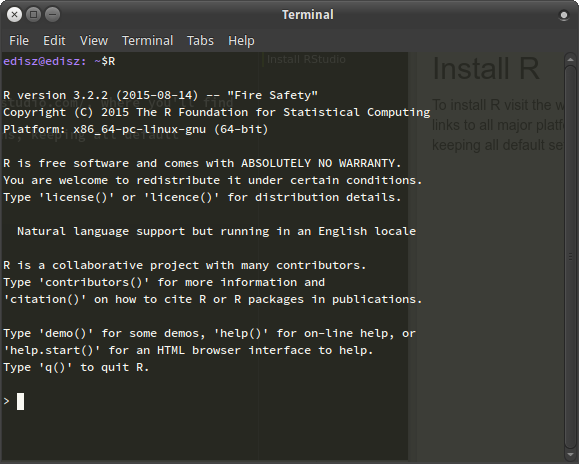
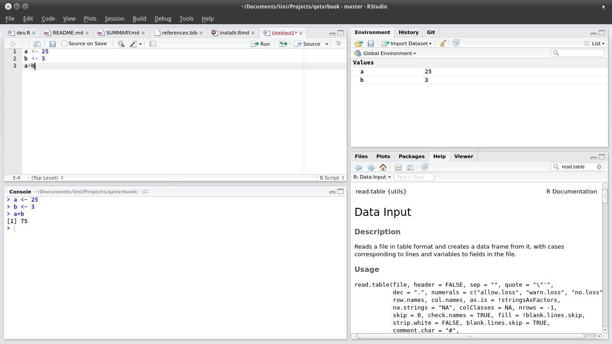

## Install R 

To install R visit the website https://cran.rstudio.com/, where you'll find download links to all major platforms. 

Download and install following the instructions and keeping all default settings.

## Install RStudio

R is a command line program. On Linux it looks like this:

Luckily, there are some Graphical User Interfaces (GUI) to R. 
If you're on Windows, R is already shipped with one.
If you click on the R icon you'll see something like this:

This is a very basic GUI and we recommend to use the RStudio interface (*).

RStudio can be downloaded and installed from [www.rstudio.com](https://www.rstudio.com/products/RStudio/#Desktop).

Again, simply follow the instructions. 
If you open RStudio it will look like this:

*Note, that there are many more user interfaces available, e.g. [Tinn-R (Windows only)](http://www.sciviews.org/Tinn-R/) or the [RCommander](http://socserv.mcmaster.ca/jfox/Misc/Rcmdr/). See [here](http://www.sciviews.org/_rgui/) for an overview.
