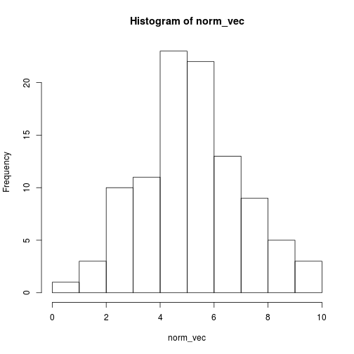
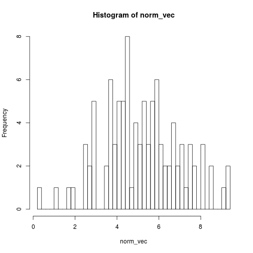
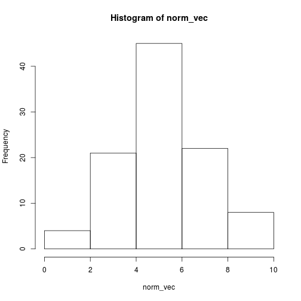
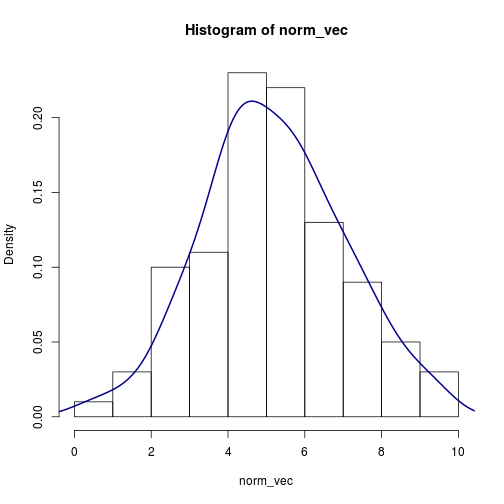

## Basic Plotting

In this chapter we will explore the basic (but powerful) plotting capabilities of R. 
I later chapters I will also use the plotting system of ggplot [---!!!link!!!---]. 
However, I refer readers to [---!!!link source!!!---] for an introdution to ggplot.


### Plotting the distribution of a variable

First I generate 100 random data points from a N(5, 2) distribution.


```r
set.seed(123)
norm_vec <- rnorm(100, 5, 2)
```

One of the best method to plot distributions is a **histogram**:


```r
hist(norm_vec)
```

 

Note, that the number of bars is automatically computed by R.
However, we can change this and increase the number of bars to show more details:


```r
hist(norm_vec, breaks = 40)
```

 

or less bars, where we loose information.


```r
hist(norm_vec, breaks = 5)
```

 


Note, if we set `freq = FALSE` the area under the histogram is scaled to 1. 
This also allows us to draw a **density** line (this is like a smooth histogram) to the histogram.


```r
hist(norm_vec, freq = FALSE)
lines(density(norm_vec), col = 'darkblue', lwd = 2)
```

 

Note, that I used two additional arguments here:

* `col`, (=color) to specify the color of the line to darkblue (default = 'black') 
* ` lwd`, (=linewidth) to increase the thickness of the line (default = 1)

(Exercise: Change the colors of the bars of the histograms from above to a light gray.)

### Plotting two continuous variables


